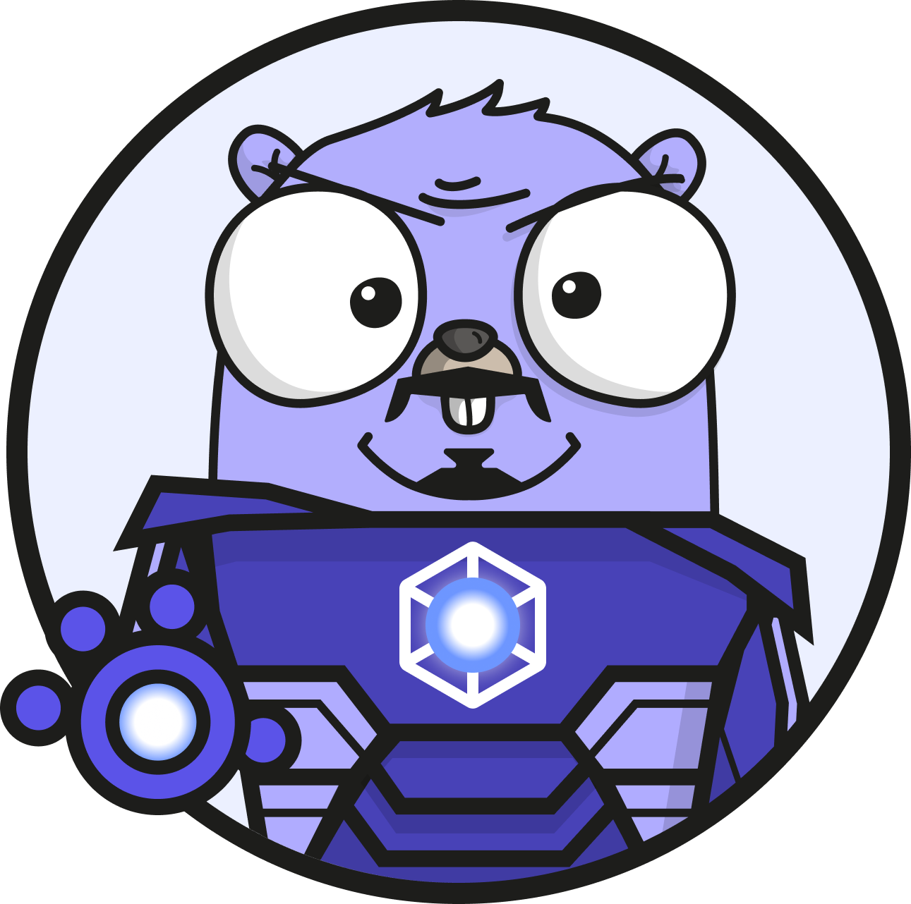
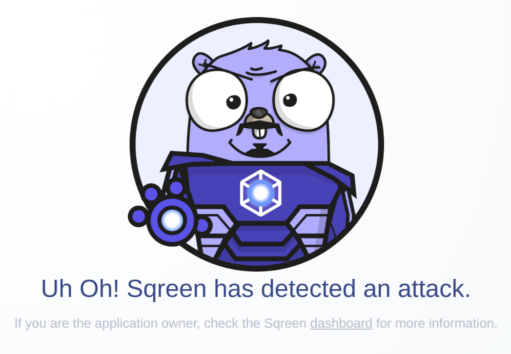

<p align="center">

</p>

# [Sqreen](https://www.sqreen.com/)'s Application Security Management for Go

After performance monitoring (APM), error and log monitoring it’s time to add a
security component into your app. Sqreen’s microagent automatically monitors
sensitive app’s routines, blocks attacks and reports actionable infos to your
dashboard.

<p align="center">

</p>

Sqreen provides automatic defense against attacks:

- Protect with security modules: RASP (Runtime Application Self-Protection),
  in-app WAF (Web Application Firewall), Account takeovers and more.

- Sqreen’s modules adapt to your application stack with no need of configuration.

- Prevent attacks from the OWASP Top 10 (Injections, XSS and more), 0-days,
  data Leaks, and more.
  
- Create security automation playbooks that automatically react against
  your advanced business-logic threats.

For more details, visit [sqreen.com](https://www.sqreen.com/)

# Quick start

1. Use the middleware function for the Go web framework you use:
   - [net/http](https://godoc.org/github.com/sqreen/go-agent/sdk/middleware/sqhttp)
   - [Gin](https://godoc.org/github.com/sqreen/go-agent/sdk/middleware/sqgin)
   - [Echo](https://godoc.org/github.com/sqreen/go-agent/sdk/middleware/sqecho/v4)

   If your framework is not listed, it is usually possible to use instead the
   standard `net/http` middleware. If not, please, let us know by [creating an
   issue](http://github.com/sqreen/go-agent/issues/new).

1. Compile your program with Sqreen

   Sqreen's dynamic configuration of your protection is made possible thanks to
   Go instrumentation. It is safely performed at compilation time by the following
   instrumentation tool.

   Install the following instrumentation tool and compile your program using it
   in order to enable Sqreen.

   1. Use `go build` to download and compile the instrumentation tool:

      ```console
      $ go build github.com/sqreen/go-agent/sdk/sqreen-instrumentation
      ```

   1. Configure the Go toolchain to use it:

      Use the instrumentation tool using the go options
      `-a -toolexec /path/to/sqreen-instrumentation`.

      It can be done either in your Go compilation command lines or by setting the
      `GOFLAGS` environment variable.
      
      For example, the following two commands are equivalent:
      ```console
      $ go build -a -toolexec $PWD/sqreen-instrumentation-tool my-project
      $ env GOFLAGS="-a -toolexec $PWD/sqreen-instrumentation-tool" go build my-project
      ```
    
1. [Signup to Sqreen](https://my.sqreen.io/signup) to get a token for your app,
   and store it in the agent's configuration file `sqreen.yaml`:
   
    ```sh
    app_name: Your Go app name
    token: your token
    ```
   
   This file can be stored in your current working directory when starting the
   executable, the same directory as your app's executable file, or in any other
   path by defining the configuration file location into the environment
   variable `SQREEN_CONFIG_FILE`.

Congratulations, your Go web application is now protected by Sqreen!

<p align="center">

</p>


# Advanced integration

Optionally, use the SDK to perform [user monitoring](https://docs.sqreen.com/go/user-monitoring/)
or [custom security events](https://docs.sqreen.com/go/custom-events/) you would
like to track and possibly block.
