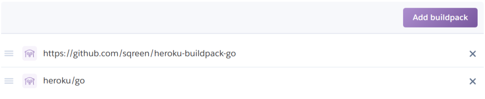

# Heroku App Example

This example allows to create a Go web server that serves "Hello HTTP!".

It uses the official Heroku buildpack for Go (https://github.com/heroku/heroku-buildpack-go)
along with Sqreen's (https://github.com/sqreen/heroku-buildpack-go).

## Heroku Button

Click the following Heroku Button to directly deploy it to Heroku:

## Instructions

Please read the following instructions in order to add Sqreen to your Heroku Go
app:

1. Add Sqreen's buildpack `https://github.com/sqreen/heroku-buildpack-go` before the official `heroku-buildpack-go`:

 
2. Add the Sqreen addon: https://elements.heroku.com/addons/sqreen

3. Add Sqreen's HTTP middleware for your framework: https://godoc.org/github.com/sqreen/go-agent/sdk/middleware

4. Deploy your Go app to Heroku.

You can then hit the app URL to see the `Hello HTTP!` web server response, now
protected by Sqreen!

